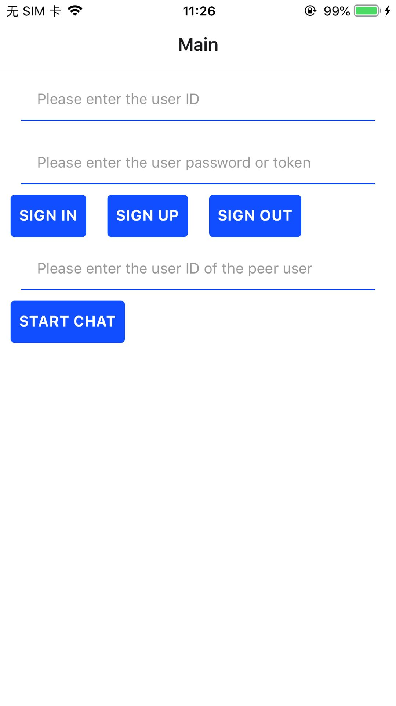
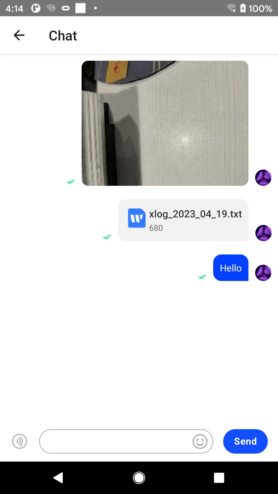

# Get started with Agora Chat UIKit

Instant messaging connects people wherever they are and allows them to communicate with others in real time. With built-in user interfaces (UI) for the message list, the [Agora Chat UI Samples](https://docs.agora.io/en/agora-chat/get-started/get-started-uikit?platform=react-native) enables you to quickly embed real-time messaging into your app without requiring extra effort on the UI.

This page shows a sample code to add peer-to-peer messaging into your app by using the Agora Chat UI Samples.

## Understand the tech

The following figure shows the workflow of how clients send and receive peer-to-peer messages:


1. Clients retrieve a token from your app server.
2. Client A and Client B log in to Agora Chat.
3. Client A sends a message to Client B. The message is sent to the Agora Chat server and the server delivers the message to Client B. When Client B receives the message, the SDK triggers an event. Client B listens for the event and gets the message.

## Prerequisites

- react-native: 0.66.0 or later
- nodejs: 16.18.0 or later

## Token generation

This section describes how to register a user at Agora Console and generate a temporary token.

### Register a user

To generate a user ID, do the following:

1. On the **Project Management** page, click **Config** for the project you want to use.


2. On the **Edit Project** page, click **Config** next to **Chat** below **Features**.


3. In the left-navigation pane, select **Operation Management** > **User** and click **Create User**.


4. In the **Create User** dialog box, fill in the **User ID**, **Nickname**, and **Password**, and click **Save** to create a user.


### Generate a user token

To ensure communication security, Agora recommends using tokens to authenticate users logging in to an Agora Chat system.

For testing purposes, Agora Console supports generating Agora chat tokens. To generate an Agora chat token, do the following:

1. On the **Project Management** page, click **Config** for the project you want to use.


2. On the **Edit Project** page, click **Config** next to **Chat** below **Features**.


3. In the **Data Center** section of the **Application Information** page, enter the user ID in the **Chat User Temp Token** box and click **Generate** to generate a token with user privileges.


## Project setup

### 1. Create a React-Native project

Open a terminal, enter a directory in which you want to create a React-Native project, and run the following command to create a project folder named `RNUikitSample`.

```sh
npx react-native init RNUikitSample --template react-native-template-typescript
```

### 2. Initialize the project

Run the `yarn` command to initialize the React-Native project:

```sh
yarn
```

### 3. Set up the project

1. Open a terminal, enter the `RNUikitSample` directory, and run the following commands to add the Agora Chat SDK and UIKit SDK in `package.json`.

```sh
yarn add react-native-chat-sdk
yarn add react-native-chat-uikit
```

For the project details, see the [react-native-chat-uikit repo](https://github.com/AgoraIO-Usecase/AgoraChat-rn/tree/dev/packages/react-native-chat-uikit).

2. Add page routing components:

```sh
yarn add @react-navigation/native
yarn add @react-navigation/native-stack
yarn add react-native-safe-area-context
yarn add react-native-screens
```

3. Add dependencies required by the UIKit SDK:

```sh
yarn add @react-native-clipboard/clipboard
yarn add @react-native-firebase/app
yarn add @react-native-firebase/messaging
yarn add @react-native-camera-roll/camera-roll
yarn add @react-native-async-storage/async-storage
yarn add react-native-audio-recorder-player
yarn add react-native-create-thumbnail
yarn add react-native-document-picker
yarn add react-native-file-access
yarn add react-native-image-picker
yarn add react-native-permissions
yarn add react-native-video
yarn add react-native-get-random-values
```

### ios

1. Add permissions in `Info.plist`:

```xml
<key>NSLocationWhenInUseUsageDescription</key>
<string></string>
<key>NSMicrophoneUsageDescription</key>
<string>mic</string>
<key>NSPhotoLibraryUsageDescription</key>
<string>photo</string>
<key>NSUserNotificationsUsageDescription</key>
<string>notifications</string>
```

2. Add additional configurations in `Podfile`:

```ruby
   pod 'GoogleUtilities', :modular_headers => true
   pod 'FirebaseCore', :modular_headers => true
```

```ruby
   permissions_path = File.join(File.dirname(`node --print "require.resolve('react-native-permissions/package.json')"`), "ios")
   pod 'Permission-Camera', :path => "#{permissions_path}/Camera"
   pod 'Permission-MediaLibrary', :path => "#{permissions_path}/MediaLibrary"
   pod 'Permission-Microphone', :path => "#{permissions_path}/Microphone"
   pod 'Permission-Notifications', :path => "#{permissions_path}/Notifications"
   pod 'Permission-PhotoLibrary', :path => "#{permissions_path}/PhotoLibrary"
```

### android

1. Add permissions in `AndroidManifest.xml`:

```xml
   <uses-permission android:name="android.permission.INTERNET"/>
   <uses-permission android:name="android.permission.CAMERA" />
   <uses-permission android:name="android.permission.READ_EXTERNAL_STORAGE" />
   <uses-permission android:name="android.permission.WRITE_EXTERNAL_STORAGE" />
   <uses-permission android:name="android.permission.RECORD_AUDIO" />
```

2. Add `kotlin` support in `build.gradle`:

```groovy
buildscript {
     ext {
         //...
         kotlinVersion = '1.6.10'
         if (findProperty('android. kotlinVersion')) {
             kotlinVersion = findProperty('android. kotlinVersion')
         }
     }
     dependencies {
         //...
         classpath("org.jetbrains.kotlin:kotlin-gradle-plugin:$kotlinVersion")
     }
}
```

## Implement one-to-one messaging

### Configure the local environment

```typescript
export const RootParamsList: Record<string, object | undefined> = {
  Main: {},
  Chat: {},
};
export let appKey = '<your app key>';
export let defaultId = '<your user ID>';
export let defaultPs = '<your user token>';
export const autoLogin = false;
export const debugModel = true;
export const defaultTargetId = '<peer user ID>';

try {
  appKey = require('./env').appKey;
  defaultId = require('./env').id;
  defaultPs = require('./env').ps;
} catch (error) {
  console.error(error);
}
```

### Initialize the UIKit SDK

```typescript
const Root = createNativeStackNavigator();

const App = () => {
  return (
    <UikitContainer
      option={{
        appKey: '<your app key>',
        autoLogin: false,
        debugModel: true,
      }}>
      <NavigationContainer>
        <Root.Navigator initialRouteName="Main">
          <Root.Screen name="Main" component={MainScreen} />
          <Root.Screen name="Chat" component={ChatScreen} />
        </Root.Navigator>
      </NavigationContainer>
    </UikitContainer>
  );
};

export default App;
```

### Implement the login page

```typescript
export function MainScreen({
  navigation,
}: NativeStackScreenProps<typeof RootParamsList>): JSX.Element {
  const placeholder1 = 'Please enter the user ID';
  const placeholder2 = 'Please enter the user password or token';
  const placeholder3 = 'Please enter the user ID of the peer user';
  const [id, setId] = React.useState(defaultId);
  const [token, setToken] = React.useState(defaultPs);
  const [chatId, setChatId] = React.useState(defaultTargetId);
  const {login: loginAction, logout: logoutAction} = useChatSdkContext();
  const logRef = React.useRef({
    logHandler: (message?: any, ...optionalParams: any[]) => {
      console.log(message, ...optionalParams);
    },
  });

  dlog.handler = (message?: any, ...optionalParams: any[]) => {
    logRef.current?.logHandler?.(message, ...optionalParams);
  };

  const login = () => {
    loginAction({
      id: '<your id>',
      pass: '<your token>',
      onResult: (result: {result: boolean; error?: any}) => {
        console.log('logout:', result.result, result.error);
      },
    });
  };
  const logout = () => {
    logoutAction({
      onResult: (result: {result: boolean; error?: any}) => {
        dlog.log('logout:', result.result, result.error);
      },
    });
  };
  const gotoChat = () => {
    if (chatId.length > 0) {
      navigation.push('Chat', {chatId: chatId, chatType: 0});
    }
  };
  return (
    <ScreenContainer mode="padding" edges={['right', 'left', 'bottom']}>
      <View style={styles.container}>
        <View style={styles.inputContainer}>
          <TextInput
            style={styles.input}
            placeholder={placeholder1}
            value={id}
            onChangeText={t => {
              setId(t);
            }}
          />
          <TextInput
            style={styles.input}
            placeholder={placeholder2}
            value={token}
            onChangeText={t => {
              setToken(t);
            }}
          />
        </View>
        <View style={styles.buttonContainer}>
          <Button style={styles.button} onPress={login}>
            SIGN IN
          </Button>
          <Button style={styles.button} onPress={logout}>
            SIGN OUT
          </Button>
        </View>
        <View style={styles.inputContainer}>
          <TextInput
            style={styles.input}
            placeholder={placeholder3}
            value={chatId}
            onChangeText={t => {
              setChatId(t);
            }}
          />
        </View>
        <View style={styles.buttonContainer}>
          <Button style={styles.button} onPress={gotoChat}>
            START CHAT
          </Button>
        </View>
        <LogMemo propsRef={logRef} />
      </View>
    </ScreenContainer>
  );
}

const styles = StyleSheet.create({
  container: {
    flex: 1,
  },
  buttonContainer: {
    flexDirection: 'row',
    justifyContent: 'flex-start',
  },
  button: {
    height: 40,
    marginHorizontal: 10,
  },
  inputContainer: {
    marginHorizontal: 20,
  },
  input: {
    height: 40,
    borderBottomColor: '#0041FF',
    borderBottomWidth: 1,
    backgroundColor: 'white',
    marginVertical: 10,
  },
});
```



### Implement the chat page

```typescript
export function ChatScreen({
  route,
}: NativeStackScreenProps<typeof RootParamsList>): JSX.Element {
  const chatRef = React.useRef<ChatFragmentRef>({} as any);
  const chatId = React.useRef((route.params as any).chatId ?? '').current;
  // const chatType = (route.params as any).chatType ?? 0;
  const [showSheet, setShowSheet] = React.useState(false);

  const onPressInInputVoiceButton = () => {
    Services.ms
      .startRecordAudio({
        audio: {
          AudioEncoderAndroid: AudioEncoderAndroidType.AAC,
          AudioSourceAndroid: AudioSourceAndroidType.MIC,
          AVModeIOS: AVModeIOSOption.measurement,
          AVEncoderAudioQualityKeyIOS: AVEncoderAudioQualityIOSType.high,
          AVNumberOfChannelsKeyIOS: 2,
          AVFormatIDKeyIOS: AVEncodingOption.aac,
        } as AudioSet,
        onPosition: pos => {
          dlog.log('test:startRecordAudio:pos:', pos);
        },
        onFailed: error => {
          console.warn('test:startRecordAudio:onFailed:', error);
        },
        onFinished: ({result, path, error}) => {
          dlog.log('test:startRecordAudio:onFinished:', result, path, error);
        },
      })
      .then(result => {
        dlog.log('test:startRecordAudio:result:', result);
      })
      .catch(error => {
        console.warn('test:startRecordAudio:error:', error);
      });
  };
  const onPressOutInputVoiceButton = () => {
    dlog.log('test:onPressOutInputVoiceButton:', Services.dcs);
    let localPath = Services.dcs.getFileDir(chatId, uuid());
    Services.ms
      .stopRecordAudio()
      .then((result?: {pos: number; path: string}) => {
        if (result?.path) {
          const extension = getFileExtension(result.path);
          localPath = localPath + extension;
          Services.ms
            .saveFromLocal({
              targetPath: localPath,
              localPath: result.path,
            })
            .then(() => {
              onVoiceRecordEnd?.({
                localPath,
                duration: result.pos / 1000,
              });
            })
            .catch(error => {
              console.warn('test:startRecordAudio:save:error', error);
            });
        }
      })
      .catch(error => {
        console.warn('test:stopRecordAudio:error:', error);
      });
  };
  const onVoiceRecordEnd = (params: {localPath: string; duration: number}) => {
    chatRef.current.sendVoiceMessage(params);
  };

  const More = () => {
    if (showSheet === false) {
      return null;
    }

    const handlers1 = {
      onStartShouldSetResponder: (_: GestureResponderEvent): boolean => {
        return true;
      },
      onStartShouldSetResponderCapture: (_: GestureResponderEvent): boolean => {
        return false;
      },
      onResponderGrant: (_: GestureResponderEvent) => {},
      onResponderRelease: (_: GestureResponderEvent) => {
        dlog.log('test:onResponderRelease:1:');
        setShowSheet(false);
      },
    } as GestureResponderHandlers;
    const handlers2 = {
      onStartShouldSetResponder: (_: GestureResponderEvent): boolean => {
        return true;
      },
      onStartShouldSetResponderCapture: (_: GestureResponderEvent): boolean => {
        return false;
      },
      onResponderGrant: (_: GestureResponderEvent) => {},
      onResponderRelease: (_: GestureResponderEvent) => {
        dlog.log('test:onResponderRelease:2:');
      },
    } as GestureResponderHandlers;

    const onCamera = () => {
      setShowSheet(false);
      Services.ms
        .openCamera({})
        .then(result => {
          dlog.log('openCamera:', Platform.OS, result);
          chatRef.current?.sendImageMessage([
            {
              name: result?.name ?? '',
              localPath: result?.uri ?? '',
              fileSize: result?.size ?? 0,
              imageType: result?.type ?? '',
              width: result?.width ?? 0,
              height: result?.height ?? 0,
              onResult: r => {
                dlog.log('openCamera:result:', r);
              },
            },
          ]);
        })
        .catch(error => {
          console.warn('error:', error);
        });
    };
    const onAlbum = () => {
      setShowSheet(false);
      Services.ms
        .openMediaLibrary({selectionLimit: 1})
        .then(result => {
          dlog.log('openMediaLibrary:', Platform.OS, result);
          chatRef.current?.sendImageMessage(
            result.map(value => {
              return {
                name: value?.name ?? '',
                localPath: value?.uri ?? '',
                fileSize: value?.size ?? 0,
                imageType: value?.type ?? '',
                width: value?.width ?? 0,
                height: value?.height ?? 0,
                onResult: r => {
                  dlog.log('openMediaLibrary:result:', r);
                },
              };
            }),
          );
        })
        .catch(error => {
          console.warn('error:', error);
        });
    };
    const onFiles = async () => {
      setShowSheet(false);
      const ret = await Services.ps.hasMediaLibraryPermission();
      if (ret === false) {
        await Services.ps.requestMediaLibraryPermission();
      }
      Services.ms
        .openDocument({})
        .then(result => {
          dlog.log('openDocument:', Platform.OS, result);
          chatRef.current?.sendFileMessage({
            localPath: result?.uri ?? '',
            fileSize: result?.size ?? 0,
            displayName: result?.name,
            onResult: r => {
              dlog.log('openDocument:result', r);
            },
          });
        })
        .catch(error => {
          console.warn('error:', error);
        });
    };

    return (
      <View style={[styles.moreContainer]} {...handlers1}>
        <View style={styles.contentContainer} {...handlers2}>
          <Button style={styles.button} onPress={onCamera}>
            Camera
          </Button>
          <Button style={styles.button} onPress={onAlbum}>
            Album
          </Button>
          <Button style={styles.button} onPress={onFiles as any}>
            Files
          </Button>
        </View>
      </View>
    );
  };

  const ChatFragmentMemo = React.memo(ChatFragment);
  return (
    <ScreenContainer mode="padding" edges={['right', 'left', 'bottom']}>
      <ChatFragmentMemo
        propsRef={chatRef}
        screenParams={{
          params: route.params as any,
        }}
        onPressInInputVoiceButton={onPressInInputVoiceButton}
        onPressOutInputVoiceButton={onPressOutInputVoiceButton}
        onVoiceRecordEnd={onVoiceRecordEnd}
        onClickInputMoreButton={() => {
          setShowSheet(true);
        }}
      />
      <More />
    </ScreenContainer>
  );
}

const styles = StyleSheet.create({
  moreContainer: {
    flex: 1,
    position: 'absolute',
    width: '100%',
    height: '100%',
    backgroundColor: 'rgba(0,0,0,0.4)',
    justifyContent: 'flex-end',
  },
  contentContainer: {
    height: 200,
  },
  button: {
    height: 40,
    marginHorizontal: 20,
    marginVertical: 10,
    borderRadius: 20,
  },
});
```



## Test your app

To validate the peer-to-peer messaging you have just integrated into your app using Agora Chat, perform the following operations to test the project:

1. Log in

a. Replace the placeholders of `appKey`, `userId`, and `agoraToken` with the App Key, user ID, and Agora token of the sender.

b. Select the device to run the project, run `flutter run` in the `uikit_quick_start` directory, and click `SIGN IN`.

2. Open the `MessagesPage` page

Fill in the user ID of the recipient in the `Enter recipient's user Id` box, and click `START CHAT` to open the `MessagesPage` page.

3. Send a message

On the `MessagesPage` page, click the input box, enter the information to be sent, and click `Send`.

## Next steps

For demonstration purposes, Chat provides an app server that enables you to quickly retrieve a token using the [App Key](https://docs.agora.io/en/agora-chat/get-started/enable?platform=android#get-the-information-of-the-chat-project) given in this guide. In a production context, the best practice is for you to deploy your own token server, use your own App Key to generate a token, and retrieve the token on the client side to log in to Agora. To see how to implement a server that generates and serves tokens on request, see [Authenticate your users with tokens](https://docs.agora.io/en/agora-chat/develop/authentication?platform=android).

## Reference

Complete example [Reference](https://github.com/AgoraIO-Usecase/AgoraChat-UIKit-rn)

- Run the React-Native running command `yarn run ios` or `yarn run android` to experience the demo.

-For a detailed example, see [the detailed example on Github](https://github.com/AgoraIO-Usecase/AgoraChat-rn/tree/dev/example)
